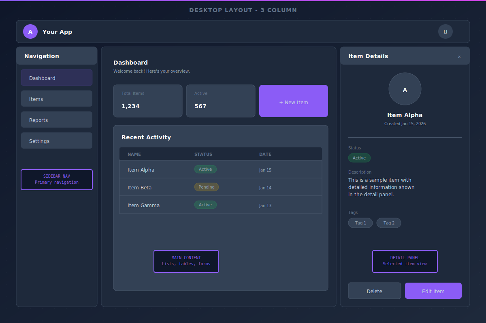

# 🎬 FirstFrame

> Project planning template with SpecKit specifications and interactive wireframe viewer.

**See your project clearly from the first frame.** Plan features with specs and wireframes before writing code.


## [👀 View Example Wireframes](https://tortoisewolfe.github.io/First-Frame/design/wireframes/)

Interactive wireframe viewer demonstrating the template structure.

## 🤔 What is FirstFrame?

FirstFrame is a planning-first development template. It helps you:

1. 📜 **Define** your project vision (constitution)
2. 📋 **Specify** features with user stories and acceptance criteria
3. 🖼️ **Visualize** UI with SVG wireframes
4. 🤖 **Feed** all this context to an LLM for implementation

The specs and wireframes you create become excellent context for AI-assisted development.

## 🧩 Why SVG Wireframes?

SVGs are text-based XML. When you create wireframes as SVGs, you're not just making pretty pictures - you're generating structured, semantic context that an LLM can actually understand.

Your AI assistant can read an SVG and know: "This is a 3-column layout. The sidebar has navigation. The main content has a data table. The detail panel shows the selected item."

That's infinitely more useful than describing your UI in prose.

## 📦 What's Included

- 🖥️ Interactive wireframe viewer with pan, zoom, and keyboard navigation
- 🎨 Example component library SVG demonstrating UI patterns (create your own from your specs)
- ⚙️ [GitHub's SpecKit](https://github.com/github/spec-kit) workflow commands built-in
- 🌗 Dark and light theme support for wireframes



## 🚀 Quick Start

```bash
# 1. Fork and clone this repo
git clone https://github.com/YOUR-USERNAME/First-Frame.git
cd First-Frame

# 2. Start Claude Code
claude

# 3. Define your project vision
/speckit.constitution

# 4. Create feature specifications
/speckit.specify

# 5. Refine requirements
/speckit.clarify

# 6. Generate wireframes
/wireframe
```

## 🏗️ Structure

```
FirstFrame/
├── docs/
│   ├── constitution-template.md   # Project vision template
│   ├── research/                  # Market & user research
│   └── design/
│       └── wireframes/            # SVG wireframes + viewer
├── specs/
│   └── example-feature.md         # Feature spec template
└── CLAUDE.md                      # AI assistant guidance
```

## ⚡ Moving to Implementation

When you're ready to build, you have options:

**Option A: Fork ScriptHammer**
[ScriptHammer.com](https://scripthammer.com) provides a ready-to-use foundation (Next.js 15, React 19, Supabase, Tailwind). Your FirstFrame specs and wireframes become rich context for implementation.

**Option B: Stay in FirstFrame**
Continue using this repo with SpecKit's full workflow (`/speckit.plan`, `/speckit.tasks`, `/speckit.implement`). Your specs and wireframes guide development right here.

## 🛠️ SpecKit Commands

| Command | Purpose |
|---------|---------|
| `/speckit.constitution` | Define project vision and principles |
| `/speckit.specify` | Create feature specifications |
| `/speckit.clarify` | Refine specs with clarifying questions |
| `/wireframe` | Generate SVG wireframes from specs |
| `/speckit.plan` | Generate implementation plan |
| `/speckit.checklist` | Generate custom implementation checklist |
| `/speckit.tasks` | Create actionable task list |
| `/speckit.analyze` | Review spec quality and consistency |
| `/speckit.implement` | Execute implementation plan |

## 🎬 Why "FirstFrame"?

Every great film starts with a single frame. Before the action, before the drama - there's that first image that sets everything in motion. Building software should work the same way.

The name is intentional wordplay:

🎯 **"First Frame"** - Like the opening shot of a movie, establish your vision before the story unfolds. Start at the beginning. See the whole picture before you build it.

👓 **"Specs"** - These are your specifications, the detailed requirements that define what you're building. But specs are also glasses - the lenses through which you see your project with crystal clarity.

🖼️ **"Frames"** - The wireframes that hold your vision in place. Just like glasses have frames that support the lenses, your UI wireframes provide the structure that supports your specifications.

✨ **Specs + Frames = clear vision, properly supported.**

---

*Planning template for AI-assisted development*
